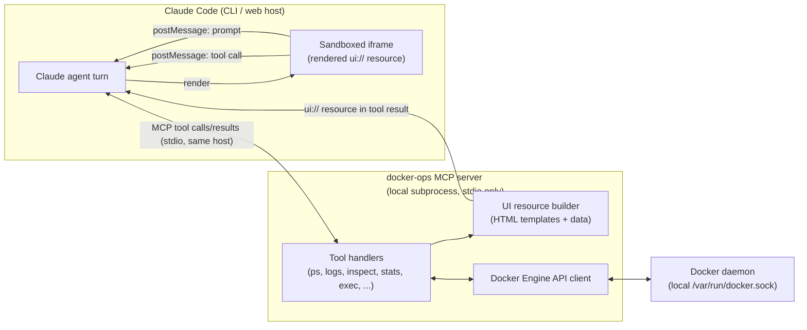
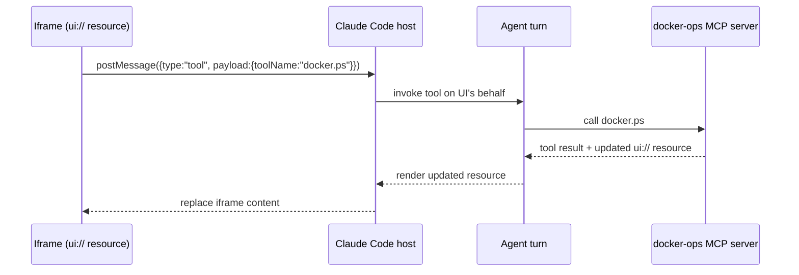
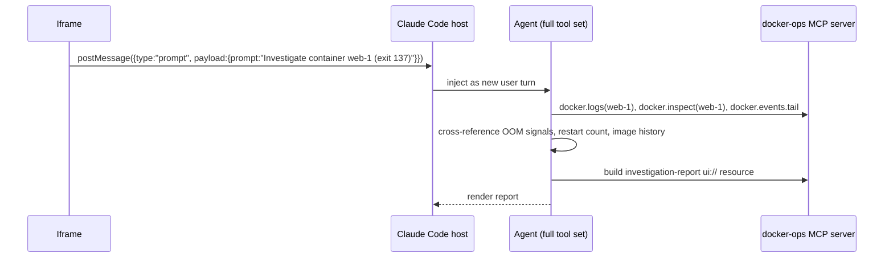

# Design: Docker Ops — an MCP-UI experiment

Status: **design only, nothing implemented**
Purpose: use a Docker operations/investigation surface as a test vehicle for the
**MCP-UI technique** (an MCP server returning renderable UI resources, wired
two ways back into a Claude Code agent) and decide whether it's worth building.

## 1. What we're actually testing

The Docker angle is secondary. The real unknown is whether MCP-UI — an MCP
tool call returning a `ui://` resource (HTML) that the host renders in an
iframe, with the iframe able to (a) call MCP tools and (b) push new prompts
into the agent's conversation — works end-to-end inside Claude Code, and
whether that round trip is fast/safe enough to be worth building on.

Docker ops is a good *second* test because it's stateful, visual, and has a
natural mix of safe (read) and dangerous (mutate) actions — useful for
proving out the permission model. But it is not the best *first* test,
because it also drags in Docker-socket security. See §13 for the
recommended spike target instead.

**Deployment model: single machine, no remote communication.** The agent,
the MCP server, the Docker daemon, and the rendered UI all run on the same
host. Concretely:

- The MCP server is spawned as a **local subprocess of the Claude Code
  host and speaks stdio**, not a network protocol (no HTTP/SSE server, no
  listening socket for the MCP connection itself). There's nothing to
  authenticate on that channel because it's never exposed off-box.
- Docker is reached through the local `/var/run/docker.sock` only —
  never a remote/TCP Docker context (already the case in §9, restated
  here as a hard constraint, not just a v1 simplification).
- If the phase-2 streaming sidecar (§8) is ever built, it binds to a Unix
  domain socket or `127.0.0.1` only, and is treated as **local IPC, not a
  network service** — no port forwarding, no binding to `0.0.0.0`, ever.
- Every tool this skill exposes operates on local resources. Nothing in
  scope calls out to a remote API, so the Stage-0 spike (§13) has to be
  chosen accordingly.

## 2. Architecture



Two independent channels come out of the iframe, and keeping them distinct is
the crux of the design:

- **`tool` messages** — "do a thing and show me the result" (list containers,
  fetch logs, restart a container). Mechanical, no reasoning needed.
- **`prompt` messages** — "figure something out for me" (why did this
  container die?). These are re-entered into the agent's conversation as a
  new user turn, so the *agent* (with its full tool set — Bash, the docker
  MCP tools, Read, etc.) does the reasoning and comes back with a new UI
  resource (an investigation report) rather than the MCP server trying to be
  smart on its own.

## 3. Components

- **`mcp-server/`** — a local MCP server (Node/TypeScript, using
  `@modelcontextprotocol/sdk` + `dockerode`) exposing Docker as tools and
  building the `ui://` resources returned alongside tool results.
- **UI resource bundle** — static HTML/CSS/JS templates embedded in the
  server (dashboard, container detail, investigation report). No external
  script/style loading — everything inlined, served with a strict CSP.
- **Claude Code skill wrapper (`SKILL.md`)** — the thing the user actually
  invokes; documents when to call which tool, how to interpret an
  "investigate" request, and the confirmation rules for mutating actions.
- **Docker Engine API bridge** — thin wrapper around the daemon socket,
  isolated behind the tool layer so nothing in the UI ever talks to the
  socket directly.

## 4. Tool catalog and risk tiers

Every tool is tagged with a tier; the tier decides whether it's
pre-approved, needs a UI-level confirm, and/or needs a host permission
prompt.

| Tier | Examples | Approval |
|---|---|---|
| 0 — read-only | `docker.ps`, `docker.inspect`, `docker.logs`, `docker.stats`, `docker.top`, `docker.events.tail`, `docker.networks.ls`, `docker.volumes.ls`, `docker.images.ls`, `docker.compose.ps`, `docker.df` | Pre-approved, no confirm |
| 1 — low-risk mutate | `docker.start`, `docker.restart` (single, named container), `docker.pause`/`unpause` | UI confirm dialog + host permission prompt |
| 2 — high-risk mutate | `docker.stop`, `docker.kill`, `docker.rm`, `docker.prune`, `docker.network.rm`, `docker.volume.rm`, `docker.compose.down` | UI confirm dialog (typed container name) + host permission prompt, off by default |
| 3 — arbitrary execution | `docker.exec` | Excluded from v1 (see §9) or restricted to a fixed command palette, never freeform |

## 5. UI screens

1. **Fleet dashboard** — card grid of containers (name, image, state, uptime,
   restart count, CPU/mem sparkline), colored by health. Click-through to
   detail. "Investigate" button appears automatically on any card in a
   non-`running`/unhealthy state.
2. **Container detail** — tabs for Logs (tail + follow via refresh),
   Stats (CPU/mem/net charts, per `dataviz` skill conventions), Inspect
   (env, mounts, network, labels), Actions (tier-gated buttons).
3. **Investigation report** — generated by the agent after a `prompt`
   round trip: timeline of events, log excerpts that support the
   hypothesis, likely root cause, and a list of suggested remediation
   actions, each rendered as its own confirm-gated tool-call button (e.g.
   "Restart with increased memory limit" isn't a real one-click action —
   more realistically "Restart container" plus a text note of what to
   change in compose/env, since the server can't edit compose files).
4. **Compose project view** — group containers by
   `com.docker.compose.project` label, project-level up/down/logs.

## 6. UI rendering stack

Split this into two layers, because they have different answers: the
**wire protocol** (resource creation, iframe handshake, postMessage
framing) should come from an existing kit, not be hand-rolled; the
**view rendering** (what's actually drawn inside the iframe) stays
vanilla, per the original reasoning below.

### 6.0 Protocol layer: use the existing kit, don't hand-roll it

What this doc was calling "the `ui://` resource + postMessage
convention" in §2/§7 is, as of early 2026, an actual spec extension —
**MCP Apps** (`modelcontextprotocol.io/extensions/apps`) — not a
bespoke convention to invent from scratch. It formalizes exactly what
§2 sketched: a tool's `_meta.ui.resourceUri` points at an HTML resource
served with mime type `text/html;profile=mcp-app`, the host renders it
in a sandboxed (double-nested) iframe, and the iframe talks back over
**JSON-RPC over postMessage** — a stricter, better-specified wire format
than the informal `{type, payload}` shape used in the sequence diagrams
in §7 (those diagrams are conceptual — the actual framing should follow
whichever SDK below is used, not be reimplemented by hand).

Two concrete kits exist and should be used instead of writing this
plumbing from scratch:

- **[`mcp-ui`](https://github.com/idosal/mcp-ui)** (`@mcp-ui/server` +
  `@mcp-ui/client` on npm, plus a `mcp-ui` package on PyPI) — the
  community project that originated this pattern. Server side:
  `createUIResource()` builds the resource (raw HTML, an external URL
  iframe, or Shopify Remote DOM for host-styled components) in a few
  lines instead of hand-assembling the resource envelope. Client side:
  `<UIResourceRenderer />` (or a framework-agnostic web component) does
  the iframe sandboxing and decodes actions (`tool`, `prompt`, `link`,
  `intent`, `notify`) for you.
- **The official MCP Apps SDK** (referenced from
  `modelcontextprotocol.io/extensions/apps/build`) — the sanctioned
  implementation of the now-standardized extension, built on top of
  `@modelcontextprotocol/sdk`. Prefer this over `mcp-ui` once it's
  stable enough for this use case, since it's the version Anthropic's
  own surfaces are implementing against (see the support caveat below);
  `mcp-ui` remains a reasonable fallback/reference if the official SDK
  is still too rough at implementation time.

Either kit removes exactly the class of bug visible in the wild right
now — malformed CSP metadata, iframe handshakes that never complete —
without us having to get the framing right by hand. Pick one during the
Stage-0 spike (§13) rather than deciding today; the spike is exactly
where "does this kit's happy path actually work against the host I'm
targeting" gets answered.

**Resolved by the Stage-0 build (see §13 status):** went with the
official MCP Apps SDK, specifically `@modelcontextprotocol/ext-apps@^2.0.0`
paired with `@modelcontextprotocol/server@2.0.0` (the current split-package
SDK generation — *not* the older `@modelcontextprotocol/sdk` monolith;
`ext-apps@1.7.5` targets that older generation and was considered, but the
official examples and current docs are all on the v2 generation, so
that's what this repo builds against). `mcp-ui` was evaluated but not
used: its own supported-hosts table doesn't list Claude at all, while
`ext-apps`'s README links directly to `claude.com/docs/connectors/
building/mcp-apps/getting-started` — a much stronger signal for a
Claude-targeted skill. One concrete cost worth carrying forward: the
`App` class + its dependencies (including zod, pulled in transitively)
inline to **~240 KB of HTML per resource response** (measured, not
estimated — see `mcp-server/test/smoke.ts` output). That's the price of
not hand-rolling the protocol layer; §6.1's "keep the view layer small"
guidance is partly there to keep the *other* half of the payload from
also growing.

**Important open risk, not yet resolved as of this writing (Sept
2026):** public reporting says MCP Apps rendering is live in Claude
Desktop, claude.ai, Claude Cowork, VS Code Copilot, and a few other
hosts — **but explicitly *not* in the Claude Code CLI itself.** The
Claude Code changelog as of mid-September 2026 shows MCP-related fixes
(disconnect handling, OAuth, tool search) but nothing indicating UI
resource rendering landed. If the real target for this skill is "the
Claude Code CLI on someone's Docker host," that target may not render
any of this yet, which would mean either waiting, or aiming the Stage-0
spike at Claude Desktop/claude.ai/Cowork instead to validate the
technique while CLI support catches up. Re-check
`code.claude.com/docs/en/changelog` immediately before starting Stage 0
— this is the kind of thing that could easily have shipped between
writing this doc and reading it.

### 6.1 View rendering: still vanilla, no framework

**Default: no framework — vanilla JS/DOM, hand-rolled inline SVG for
charts, plain CSS.** This follows directly from constraints already set
elsewhere in this doc, not from a general dislike of frameworks:

- The CSP in §9 forbids loading any remote script/style — everything has
  to be inlined into the `ui://` resource's HTML string. Whatever UI code
  runs has to ship as bytes inside every tool result, and per §8 that
  resource gets rebuilt on every refresh/poll. A framework runtime is a
  fixed tax on every one of those round trips; vanilla JS has none.
- The screens in §5 are cards, tables, tabs, a log pane, small
  charts, and confirm dialogs — plain DOM manipulation handles all of
  that without needing component lifecycle, virtual DOM diffing, or a
  state-management layer.
- Fewer moving parts is also a security property here: §9 already treats
  the iframe as untrusted-ish and reasons about exactly what code runs
  inside it. A framework is more surface to have read through once, for
  no behavior this UI needs.
- Charts (CPU/mem sparklines, per the `dataviz` skill referenced in §5):
  hand-rolled inline `<svg>`, not a charting library. Something like
  Chart.js is either pulled from a CDN (forbidden by the CSP and by the
  no-network-dependency rule in §1) or vendored in full (tens of KB
  inlined into every dashboard response for a handful of sparklines) —
  a bad trade either way for shapes this simple.
- One small shared script (`assets/app.js` in §10) is reused — verbatim,
  inlined — across every template. It is *not* a UI framework: it wraps
  whichever kit was picked in §6.0 for dispatching `tool`/`prompt`
  actions (so the wire framing stays kit-owned, not hand-rolled) plus a
  couple of local DOM helpers (`h()`-style element builders, event
  delegation for tier-gated confirm dialogs).

**Escape hatch, not a default:** if the investigation-report view
(§5, item 3) turns out to need real component composition once Stage 3 is built —
nested, conditionally-rendered panels, re-used list/card components — the
fallback is **Preact + htm** (~4 KB gzipped, no JSX build step since htm
uses tagged template literals). It compiles to a single minified script
inlined the same way as the vanilla helper, so it doesn't break the
CSP/no-network constraint — it's just a bigger inline payload. Reach for
it only when plain DOM code has visibly become the harder path to read,
not by default.

**Explicitly ruled out:**
- React/Vue/Angular — runtime and typical component-library weight isn't
  justified by screens this simple, and it's a much bigger inline payload
  on every response.
- Any kit that assumes CDN-hosted fonts/icons/CSS (Bootstrap-via-CDN,
  Font Awesome, Tailwind's CDN build) — violates the CSP in §9 outright;
  a self-hosted/inlined Tailwind build is possible but adds a build step
  for no real benefit over a small hand-written stylesheet at this scale.
- htmx — its whole model is "fetch HTML over HTTP on interaction," which
  doesn't fit the stdio/tool-call channel in §1. Only worth reconsidering
  if the phase-2 local streaming sidecar (§8) grows into something htmx
  could target directly, and even then it'd be additive, not a
  replacement for the tool/prompt postMessage protocol.

## 7. Communication protocol in detail

### 7.1 Data round trip (`tool` messages)



Tier 0 tools are pre-approved so this loop never stalls on a permission
prompt; that's what makes "Refresh" and polling viable.

### 7.2 Investigation round trip (`prompt` messages)



The agent — not the MCP server — owns the reasoning. The server's job is
only to fetch data and package it as tool results / UI templates; keeping
"smart" logic out of the server means the investigation quality scales with
the agent's normal tool-use ability instead of a bespoke rules engine that
has to be separately maintained.

## 8. State and refresh strategy

MCP tool results are point-in-time snapshots, so "live" views need one of:

- **MVP: manual refresh** — a button in the UI re-issues the same `tool`
  message. Simplest, no extra infra, fine for a first cut.
- **Polling** — UI JS calls the same `tool` message every N seconds. Only
  viable for tier-0 tools (no permission-prompt spam). Needs a visible
  "auto-refresh: on/off" toggle so it's not silently hammering the host.
- **Phase 2: sidecar streaming** — the MCP server also opens a
  **loopback-only** endpoint (prefer a Unix domain socket; if TCP is the
  only option the runtime allows, bind strictly to `127.0.0.1`, never
  `0.0.0.0`) that the iframe connects to directly for true
  log-follow/stats-tick behavior, bypassing the MCP round trip entirely.
  Even though nothing leaves the machine, still use a short-lived
  per-session token embedded in the resource rather than a static
  no-auth endpoint — other local users/processes on the same box could
  otherwise reach it — and take care with iframe sandbox attributes (see
  §9) since this is a live same-origin-ish channel. Deferred until the
  basic technique is proven.

## 9. Security and permission model

- **Docker socket access is root-equivalent on the host.** There is no
  fine-grained read-only mode for the socket itself, so all access control
  has to live in the tool layer, not the transport. Treat "can drive this
  skill" as "has root on this Docker host" when deciding who gets to enable
  it.
- **`docker.exec` is excluded from v1.** If it's added later, restrict it to
  a fixed palette of diagnostic commands (`ps aux`, `env`, `df -h`, `cat
  /proc/1/status`, ...) selected from a dropdown in the UI, never a
  freeform text field — freeform exec into a container is effectively
  freeform code execution with container/host escape risk depending on
  privilege mode.
- **`docker.inspect` returns env var names, never values.** Not anticipated
  when this table was first written — found during Stage 1 implementation.
  Any *read-only* tool's output becomes part of the model's context, and
  container env vars routinely carry secrets (API keys, DB passwords).
  There's no way to redact selectively without a real secrets-detection
  pass, so the rule is blunt: names only, always. Applies to every future
  read-only tool that might surface env/config data (e.g. a Stage 2
  compose-file viewer), not just this one.
- **Tier 1/2 actions require both** a UI-side confirm (re-type the
  container name for tier 2) **and** rely on the host's normal MCP tool
  permission prompt — defense in depth, since a compromised or buggy
  iframe shouldn't be able to single-click its way to `docker.rm`. As
  implemented (§11 item 4 status), "defense in depth" is doing real
  work here, not just a phrase: the UI confirm is iframe-enforced and
  could in principle be bypassed by a compromised resource, so the host
  prompt is the actual backstop. `destructiveHint`/`readOnlyHint` tool
  annotations are set on every tool as the spec-level signal a
  compliant host can act on. A stronger option — MCP's
  `inputRequired.elicit()`, which routes confirmation through the
  host's own native UI instead of the iframe — was considered and
  deliberately not used yet, for lack of a verified usage example at
  implementation time; see §11 item 4 for the full reasoning.
- **Iframe sandboxing** — resource HTML served with a strict CSP (no
  remote script/style/font/img loading, everything inlined), `sandbox=
  "allow-scripts"` only (deliberately *not* combined with
  `allow-same-origin`, which would let a compromised template read/write
  the parent's storage), and the postMessage handler validates
  `event.source`/`event.origin` before trusting a message.
- **No remote Docker contexts, period** — local `docker.sock` only, per
  the single-machine deployment model in §1. This isn't a v1
  simplification to revisit later; remote (SSH/TCP) daemons are out of
  scope for this design entirely.
- **No network exposure anywhere in the design** — the MCP transport is
  stdio, the Docker connection is a local socket, and the optional
  streaming sidecar (§8) is loopback/Unix-socket only. The threat model
  is therefore "what can a local process or the rendered iframe do,"
  not "what can a remote attacker reach" — which is precisely why the
  iframe sandboxing and tool-tier confirms above matter more here than
  network-level auth would.

## 10. Package layout

The layout below is what actually exists in this repo today (Stages 0-4),
not a projection:

```
docker-skill/                (repo root)
  SKILL.md                   # implemented — Stage-0/1/2/3/4 usage + "how to continue" notes
  mcp-server/
    package.json              # @modelcontextprotocol/ext-apps ^2.0.0,
                               # @modelcontextprotocol/server 2.0.0, dockerode ^5, zod ^4
    tsconfig.json              # client-side (src/), DOM lib, noEmit — type-checked by Vite's build
    tsconfig.server.json       # server-side (server.ts, index.ts, docker/, test/), Node lib, emits dist/
    vite.config.ts             # vite-plugin-singlefile: bundles each entrypoint into one inlined HTML
    server.ts                  # tool registration: system-info/system-poll (Stage 0),
                                # docker-ps/docker-inspect (Stage 1),
                                # docker-logs/docker-stats (Stage 2),
                                # build-investigation-report (Stage 3),
                                # docker-start/restart/pause/unpause/stop/kill/rm (Stage 4)
    index.ts                   # entrypoint — StdioServerTransport only, no HTTP (§1)
    docker/
      client.ts                 # dockerode wrapper, local socket only (§9)
      tools/
        ps.ts                    # listContainers() — backs docker-ps
        inspect.ts                # inspectContainer(id) — backs docker-inspect; env names only (§9)
        logs.ts                   # getContainerLogs(id, tail) — backs docker-logs; hand-demuxes Docker's frame format
        stats.ts                  # getContainerStats(id) — backs docker-stats; one-shot CPU/mem/net/pids
        actions.ts                 # start/restart/pause/unpause/stop/kill/remove — Tier 1/2 (§4)
    mcp-app.html                # Stage 0 shell, referencing ./src/mcp-app.ts
    docker-dashboard.html        # Stage 1/2/4 shell, referencing ./src/docker-dashboard.ts
    investigation-report.html    # Stage 3 shell, referencing ./src/investigation-report.ts
    src/
      mcp-app.ts                # Stage 0 App instance: ontoolresult, callServerTool, sendMessage (§6.0/§7)
      mcp-app.css
      docker-dashboard.ts        # Stage 1/2/4 App instance: card grid, tabbed detail panel
                                  # (Inspect/Logs/Stats/Actions), tier-gated confirm modal, investigate
      docker-dashboard.css
      investigation-report.ts    # Stage 3 App instance: renders findings the *agent* supplies;
                                  # no refresh/polling — a terminal, point-in-time report
      investigation-report.css
    test/
      smoke.ts                  # headless verification over real stdio MCP protocol (§13/§11 status);
                                 # Stage 4 checks run a full start/stop/rm lifecycle against a
                                 # disposable container it creates and cleans up itself
    dist/                       # build output (gitignored)

    # Stage 5+ (optional, not yet created):
    #   docker/tools/compose.ts — compose project view (§5 item 4)
    #   sidecar streaming for true live logs/stats (§8 phase 2, §11 item 5)
    #   real remediation-action buttons in the investigation report, now that
    #   the Tier 1/2 tools they'd call actually exist

  docs/
    design/
      mcp-ui-docker-ops.md      <- this file
```

## 11. Staged validation plan

Build (and validate) in this order — each stage should be provably working
before the next is started:

0. **Confirm the target host renders MCP Apps at all** (§12) — check
   `code.claude.com/docs/en/changelog` (or whichever host is actually in
   play) *before* writing any code; then **spike the plumbing on
   something low-stakes** (see §13 for the recommended target) using one
   of the kits from §6.0 — confirm resources render and both `tool` and
   `prompt` actions round-trip.
   **Status: done, for the mechanism; still open for the specific
   target host.** The server/protocol half passes its own headless
   verification (`mcp-server/test/smoke.ts`). The host-rendering half —
   does it actually draw the iframe and round-trip a click — is now
   verified too, against `modelcontextprotocol/ext-apps`'s own reference
   host (`examples/basic-host`), driven with Playwright: all three
   resources render, tool calls round-trip, and the Stage 4 confirm
   dialog works end-to-end. Full account, including two real bugs this
   check found and fixed, is in §12. What that check can't answer is
   whether the Claude Code CLI specifically renders this — `basic-host`
   is a reference implementation, not Claude Code — so that half of §12's
   question stays open.
1. **Read-only dashboard** — `docker.ps` + `docker.inspect`, manual
   refresh only.
   **Status: done.** Implemented as `docker-ps` / `docker-inspect` (hyphenated,
   not dotted — matches the official examples' tool-naming convention, a
   trivial deviation from this doc's earlier shorthand) in `mcp-server/
   docker/`. `docker-dashboard.ts` renders the card grid with click-through
   to a detail panel (`docker-inspect`) and an "Investigate" button on any
   non-`running` container, same `prompt` pattern as the Stage-0 card.
   `test/smoke.ts` now also exercises both tools against a **real local
   Docker daemon** — not mocked. (This sandbox had no daemon or images
   available and no registry egress, so the test data is two minimal
   `FROM scratch` images built from small local Go binaries — a
   long-running one and one that exits with code 137 — rather than pulled
   images; the tools themselves don't care where the containers came
   from.) One security-relevant decision made during implementation, not
   anticipated in §4/§9: `docker-inspect` returns env var **names only**,
   never values, since container env commonly carries secrets and this
   tool's output becomes part of the model's context — see §9.
2. **Logs + stats views**, still read-only, charts per the `dataviz` skill.
   **Status: done, with one deviation from the original plan.** `docker-logs`
   (tail, default 100 lines) and `docker-stats` (one-shot CPU/mem/net/pids
   snapshot) are implemented in `docker/tools/{logs,stats}.ts` and surfaced
   as Inspect/Logs/Stats tabs inside the same detail panel added in Stage 1,
   rather than as a separate "container detail" resource — the tab content
   is fetched lazily per tab via `app.callServerTool`, matching §8's
   manual-refresh MVP. The "stats charts" from §5 item 2 turned out not to
   need charts at all for a one-shot (non-streaming) snapshot: it's just
   the same disk/memory-style progress bars already established in Stage 0,
   reused here for CPU%/Mem% — inline SVG sparklines would only earn their
   place once Stage 5's streaming makes a *history* worth plotting. Two
   implementation details worth carrying forward: (1) non-TTY container
   logs come back from the Docker API in a multiplexed frame format
   (8-byte header per frame) that has to be demuxed by hand — see the
   comment in `logs.ts`; (2) `docker-stats` legitimately errors on a
   stopped container (Docker's stats endpoint only works on running ones),
   which the UI now surfaces as "Stats unavailable" rather than leaving
   stale bars on screen — not a bug to fix, an expected case to display.
3. **Investigation flow** — `prompt` round trip producing an investigation
   report resource.
   **Status: done.** Added `build-investigation-report` — a model-facing
   tool that takes structured findings (`subject`, `summary`, `rootCause`,
   `timeline`, `evidence`, `suggestedRemediations`) and renders them as
   the new `investigation-report.html` resource. It's deliberately dumb:
   it gathers nothing itself, just turns the agent's own findings into UI,
   exactly matching §7.2's point that the agent — not the server — owns
   the reasoning. Both "Investigate" buttons (Stage 0's disk-usage one,
   Stage 1's per-container one) now end their prompt by telling the agent
   to call this tool with what it found, instead of just replying in
   chat. One thing this surfaced that the original §5 item 3 wording
   glossed over: "suggested remediation actions, each rendered as its own
   confirm-gated tool-call button" isn't buildable yet, because the
   confirm-gated mutating tools those buttons would call don't exist
   until item 4. `suggestedRemediations` is plain text for now, and both
   Investigate prompts now explicitly tell the agent not to take any
   action on its own — only report and suggest. Wiring real buttons is
   item 4's job once there's something safe for them to call.
4. **Gated mutating actions** — tier 1/2 with confirms wired in.
   **Status: done, with one honest gap.** `docker/tools/actions.ts` backs
   seven new tools — Tier 1: `docker-start`, `docker-restart`,
   `docker-pause`, `docker-unpause`; Tier 2: `docker-stop`, `docker-kill`,
   `docker-rm` (no `force` option — removing a running container fails
   loudly rather than silently stopping it first). Every tool carries the
   standard MCP `readOnlyHint`/`destructiveHint`/`idempotentHint`/
   `openWorldHint` annotations (retrofitted onto the Stage 0-3 tools too,
   for correctness) — the spec-level signal a compliant host can use to
   require its own confirmation, layered on top of, not instead of, the
   UI-side confirm. The dashboard's new Actions tab shows only the
   buttons valid for the container's current state (e.g. no "Start" on
   something already running), Tier 1 gets a plain confirm dialog, Tier 2
   requires typing the exact container name before the Confirm button
   enables.

   **The gap, stated plainly rather than glossed over:** the type-to-confirm
   dialog is enforced by this resource's own JavaScript, running inside
   the sandboxed iframe. A compromised or buggy template could in
   principle skip straight to calling `app.callServerTool({name:
   "docker-rm", ...})` without ever showing the dialog. The real backstop
   is the host's own MCP permission prompt on the tool call itself — which
   is exactly why §9 called this "defense in depth" rather than "the UI
   confirm is sufficient." A more rigorous version exists and was
   considered: MCP's elicitation capability (`inputRequired.elicit()` in
   `@modelcontextprotocol/server`) lets a tool handler pause mid-call and
   have the *host's own native UI* — not our iframe — collect the
   confirmation, which a compromised resource can't bypass by construction.
   It wasn't used here because it's new enough (introduced alongside the
   2026-07-28 MCP Apps wire revision) that no example usage was found to
   verify the pattern against, and getting a security-relevant mechanism
   wrong via guesswork seemed worse than being explicit about relying on
   the UI-dialog-plus-host-prompt combination instead. Revisit this if
   the mutating tools ever move beyond an experimental spike.
5. *(optional)* **Sidecar streaming** for true live logs/stats.

## 12. Open questions / risks

- **Does the actual target host render MCP Apps UI resources at all?**
  **Resolved at the mechanism level — the technique itself genuinely
  works.** Ran the real `mcp-server` (unmodified, just given a temporary
  loopback-only HTTP transport instead of stdio, since the reference
  host connects over Streamable HTTP) against
  `modelcontextprotocol/ext-apps`'s own reference host implementation
  (`examples/basic-host`), driven headlessly with Playwright/Chromium
  (already available in this environment). All three UI resources
  render correctly inside the host's double-iframe sandbox: the system
  card (disk/memory bars, git status), the Docker dashboard (card grid,
  click-through to a tabbed detail panel, state-aware Tier 1/2 action
  buttons, the type-to-confirm dialog), and the investigation report
  (timeline, evidence, root cause). Full tool-call round trips, resource
  re-rendering, and host-context/theme sync all worked as designed.
  **What this does *not* answer:** whether the Claude Code CLI
  specifically renders it — `basic-host` is a reference/test
  implementation, not Claude Code. That half of the original question
  is still open; re-check `code.claude.com/docs/en/changelog` before
  assuming either way, per the guidance elsewhere in this doc.
- **Two real bugs were only found because this rendering check
  happened at all** — the headless `smoke.ts` test is blind to them by
  construction, since it never renders CSS. Both were the same class of
  mistake: `.confirm-overlay` and `.investigate-section` each set their
  own `display: flex` unconditionally, and — because an author stylesheet
  rule beats the browser's default `[hidden] { display: none }` at equal
  CSS specificity — both elements stayed visible even while their
  `hidden` attribute was set (an empty confirm modal permanently
  floating over the dashboard; an empty "Investigate" box on a system
  card at 23% disk usage, nowhere near the 80% threshold). Fixed with an
  explicit `.classname[hidden] { display: none; }` override on each.
  **General lesson for any future `hidden`-toggled element in this
  project:** if its class sets `display` in CSS, it needs this override
  too — grep for `hidden` in the HTML against `display:` in the
  corresponding CSS before assuming a new toggle works.
- How does the host reconcile a `prompt` message arriving mid-turn (is it
  queued as the next turn, or does it interrupt)? Affects whether
  "Investigate" buttons feel responsive. Not answered by the basic-host
  check above — that reference host has no live agent turn to interrupt.
- What's the resource size/latency budget for a re-rendered iframe on
  every tier-0 tool call — is polling actually usable, or does each
  refresh cause a visible flash/reload? The manual-refresh flows above
  felt instant against a local reference host; this doesn't test
  networked/production hosts or the phase-2 streaming sidecar's needs.
- Does the host give any origin/identity guarantee for postMessage
  events we can rely on, or is that entirely our own validation to
  build? `basic-host`'s sandbox proxy (a separate origin, port 8081)
  does validate and relay — see its `src/sandbox.ts` — but that's this
  one reference implementation's choice, not a spec guarantee every
  host is required to make.

## 13. Recommended first spike (better test use case for Stage 0)

Before wiring anything to a Docker socket, validate the MCP-UI mechanism
itself against something with **zero blast radius and zero network
dependency** (per the single-machine constraint in §1 — no GitHub API,
no remote calls of any kind), so a plumbing bug can't be confused with a
security decision or a flaky remote call. A good candidate: a **read-only
local system card** — hostname, uptime, disk usage, and the current
git branch/status of a couple of local repos, all sourced from local
syscalls/`fs` reads, no sockets opened at all. Add a "Explain this" button
on, say, a disk-usage-over-80% row that sends a `prompt` message asking
the agent to investigate (it can freely use Bash locally — `du`, `df`,
`git log` — to do so). This exercises:

- resource rendering,
- the `tool` round trip (refresh),
- the `prompt` round trip (agent-driven investigation),
- and a report-style resource on the way back,

without touching anything privileged or leaving the machine. Once that's
proven, the Docker dashboard is a straightforward re-skin with a real
permission model layered on top per §9 — still entirely local, per the
deployment model in §1.

**Status: built.** `mcp-server/` implements exactly this — `system-info`
(hostname/CPU/memory/disk/git, one repo not "a couple," to keep the spike
small) and `system-poll` for the Refresh button, plus the disk-over-80%
"Investigate" button wired to `app.sendMessage`. `npm run smoke` in
`mcp-server/` proves the resource rendering and tool round trip at the
protocol level (see §6.0 for the resolved kit choice and measured
payload size). It does **not** yet prove the prompt round trip actually
reaches a live agent conversation, or that any host draws the iframe —
both require a real host session, not a headless script. See `SKILL.md`
at the repo root for how to run it and what's still open.
