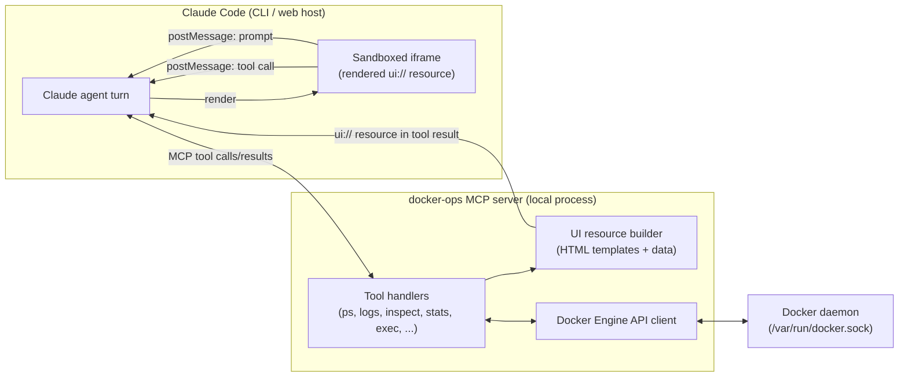
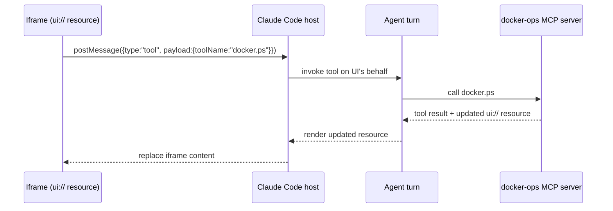
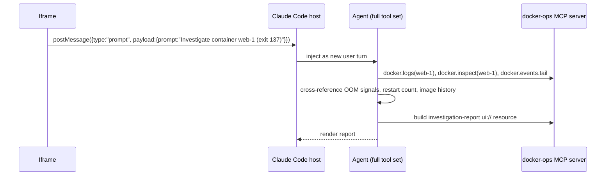

# Design: Docker Ops — an MCP-UI experiment

Status: **design only, nothing implemented**
Purpose: use a Docker operations/investigation surface as a test vehicle for the
**MCP-UI technique** (an MCP server returning renderable UI resources, wired
two ways back into a Claude Code agent) and decide whether it's worth building.

## 1. What we're actually testing

The Docker angle is secondary. The real unknown is whether MCP-UI — an MCP
tool call returning a `ui://` resource (HTML) that the host renders in an
iframe, with the iframe able to (a) call MCP tools and (b) push new prompts
into the agent's conversation — works end-to-end inside Claude Code, and
whether that round trip is fast/safe enough to be worth building on.

Docker ops is a good *second* test because it's stateful, visual, and has a
natural mix of safe (read) and dangerous (mutate) actions — useful for
proving out the permission model. But it is not the best *first* test,
because it also drags in Docker-socket security. See §12 for the
recommended spike target instead.

## 2. Architecture



Two independent channels come out of the iframe, and keeping them distinct is
the crux of the design:

- **`tool` messages** — "do a thing and show me the result" (list containers,
  fetch logs, restart a container). Mechanical, no reasoning needed.
- **`prompt` messages** — "figure something out for me" (why did this
  container die?). These are re-entered into the agent's conversation as a
  new user turn, so the *agent* (with its full tool set — Bash, the docker
  MCP tools, Read, etc.) does the reasoning and comes back with a new UI
  resource (an investigation report) rather than the MCP server trying to be
  smart on its own.

## 3. Components

- **`mcp-server/`** — a local MCP server (Node/TypeScript, using
  `@modelcontextprotocol/sdk` + `dockerode`) exposing Docker as tools and
  building the `ui://` resources returned alongside tool results.
- **UI resource bundle** — static HTML/CSS/JS templates embedded in the
  server (dashboard, container detail, investigation report). No external
  script/style loading — everything inlined, served with a strict CSP.
- **Claude Code skill wrapper (`SKILL.md`)** — the thing the user actually
  invokes; documents when to call which tool, how to interpret an
  "investigate" request, and the confirmation rules for mutating actions.
- **Docker Engine API bridge** — thin wrapper around the daemon socket,
  isolated behind the tool layer so nothing in the UI ever talks to the
  socket directly.

## 4. Tool catalog and risk tiers

Every tool is tagged with a tier; the tier decides whether it's
pre-approved, needs a UI-level confirm, and/or needs a host permission
prompt.

| Tier | Examples | Approval |
|---|---|---|
| 0 — read-only | `docker.ps`, `docker.inspect`, `docker.logs`, `docker.stats`, `docker.top`, `docker.events.tail`, `docker.networks.ls`, `docker.volumes.ls`, `docker.images.ls`, `docker.compose.ps`, `docker.df` | Pre-approved, no confirm |
| 1 — low-risk mutate | `docker.start`, `docker.restart` (single, named container), `docker.pause`/`unpause` | UI confirm dialog + host permission prompt |
| 2 — high-risk mutate | `docker.stop`, `docker.kill`, `docker.rm`, `docker.prune`, `docker.network.rm`, `docker.volume.rm`, `docker.compose.down` | UI confirm dialog (typed container name) + host permission prompt, off by default |
| 3 — arbitrary execution | `docker.exec` | Excluded from v1 (see §9) or restricted to a fixed command palette, never freeform |

## 5. UI screens

1. **Fleet dashboard** — card grid of containers (name, image, state, uptime,
   restart count, CPU/mem sparkline), colored by health. Click-through to
   detail. "Investigate" button appears automatically on any card in a
   non-`running`/unhealthy state.
2. **Container detail** — tabs for Logs (tail + follow via refresh),
   Stats (CPU/mem/net charts, per `dataviz` skill conventions), Inspect
   (env, mounts, network, labels), Actions (tier-gated buttons).
3. **Investigation report** — generated by the agent after a `prompt`
   round trip: timeline of events, log excerpts that support the
   hypothesis, likely root cause, and a list of suggested remediation
   actions, each rendered as its own confirm-gated tool-call button (e.g.
   "Restart with increased memory limit" isn't a real one-click action —
   more realistically "Restart container" plus a text note of what to
   change in compose/env, since the server can't edit compose files).
4. **Compose project view** — group containers by
   `com.docker.compose.project` label, project-level up/down/logs.

## 6. Communication protocol in detail

### 6.1 Data round trip (`tool` messages)



Tier 0 tools are pre-approved so this loop never stalls on a permission
prompt; that's what makes "Refresh" and polling viable.

### 6.2 Investigation round trip (`prompt` messages)



The agent — not the MCP server — owns the reasoning. The server's job is
only to fetch data and package it as tool results / UI templates; keeping
"smart" logic out of the server means the investigation quality scales with
the agent's normal tool-use ability instead of a bespoke rules engine that
has to be separately maintained.

## 7. State and refresh strategy

MCP tool results are point-in-time snapshots, so "live" views need one of:

- **MVP: manual refresh** — a button in the UI re-issues the same `tool`
  message. Simplest, no extra infra, fine for a first cut.
- **Polling** — UI JS calls the same `tool` message every N seconds. Only
  viable for tier-0 tools (no permission-prompt spam). Needs a visible
  "auto-refresh: on/off" toggle so it's not silently hammering the host.
- **Phase 2: sidecar streaming** — the MCP server also opens a local
  WebSocket/SSE endpoint (`ws://127.0.0.1:<port>/stream/logs/<id>`) that the
  iframe connects to directly for true log-follow/stats-tick behavior,
  bypassing the MCP round trip entirely. Needs a short-lived per-session
  token embedded in the resource (not a static port+no-auth endpoint) and
  care with iframe sandbox attributes (see §9) since this is a live
  same-origin-ish channel. Deferred until the basic technique is proven.

## 8. Security and permission model

- **Docker socket access is root-equivalent on the host.** There is no
  fine-grained read-only mode for the socket itself, so all access control
  has to live in the tool layer, not the transport. Treat "can drive this
  skill" as "has root on this Docker host" when deciding who gets to enable
  it.
- **`docker.exec` is excluded from v1.** If it's added later, restrict it to
  a fixed palette of diagnostic commands (`ps aux`, `env`, `df -h`, `cat
  /proc/1/status`, ...) selected from a dropdown in the UI, never a
  freeform text field — freeform exec into a container is effectively
  freeform code execution with container/host escape risk depending on
  privilege mode.
- **Tier 1/2 actions require both** a UI-side confirm (re-type the
  container name for tier 2) **and** rely on the host's normal MCP tool
  permission prompt — defense in depth, since a compromised or buggy
  iframe shouldn't be able to single-click its way to `docker.rm`.
- **Iframe sandboxing** — resource HTML served with a strict CSP (no
  remote script/style/font/img loading, everything inlined), `sandbox=
  "allow-scripts"` only (deliberately *not* combined with
  `allow-same-origin`, which would let a compromised template read/write
  the parent's storage), and the postMessage handler validates
  `event.source`/`event.origin` before trusting a message.
- **No remote Docker contexts in v1** — local `docker.sock` only. Remote
  (SSH/TCP) daemons multiply the blast radius and are deferred.

## 9. Package layout (for the implementation phase — not created yet)

```
docker-ops-skill/
  SKILL.md
  mcp-server/
    package.json
    src/
      index.ts
      docker/
        client.ts
        tools/
          ps.ts
          logs.ts
          inspect.ts
          stats.ts
          compose.ts
          investigate.ts
      ui/
        resources.ts
        templates/
          dashboard.html
          container-detail.html
          investigation-report.html
        assets/
          app.js
          app.css
  docs/
    design/
      mcp-ui-docker-ops.md   <- this file
```

## 10. Staged validation plan

Build (and validate) in this order — each stage should be provably working
before the next is started:

0. **Spike the plumbing on something low-stakes** (see §12 for the
   recommended target) — confirm the host actually renders `ui://`
   resources and round-trips both `tool` and `prompt` postMessages.
1. **Read-only dashboard** — `docker.ps` + `docker.inspect`, manual
   refresh only.
2. **Logs + stats views**, still read-only, charts per the `dataviz` skill.
3. **Investigation flow** — `prompt` round trip producing an investigation
   report resource.
4. **Gated mutating actions** — tier 1/2 with confirms wired in.
5. *(optional)* **Sidecar streaming** for true live logs/stats.

## 11. Open questions / risks

- **Unconfirmed: does the Claude Code host currently render MCP-UI
  resources and support the postMessage bridge at all?** This is the
  single biggest risk to the whole idea and should be answered by the
  Stage 0 spike before any Docker-specific code is written.
- How does the host reconcile a `prompt` message arriving mid-turn (is it
  queued as the next turn, or does it interrupt)? Affects whether
  "Investigate" buttons feel responsive.
- What's the resource size/latency budget for a re-rendered iframe on
  every tier-0 tool call — is polling actually usable, or does each
  refresh cause a visible flash/reload?
- Does the host give any origin/identity guarantee for postMessage
  events we can rely on, or is that entirely our own validation to build?

## 12. Recommended first spike (better test use case for Stage 0)

Before wiring anything to a Docker socket, validate the MCP-UI mechanism
itself against something with **zero blast radius**, so a plumbing bug
can't be confused with a security decision. A good candidate already
available in this environment: a **read-only repo/PR status card** built
on the existing GitHub MCP tools (`list_pull_requests`, `actions_list`) —
render a small dashboard of open PRs and their CI state, with a "Explain
this failure" button that sends a `prompt` message asking the agent to
investigate a specific failing check. This exercises:

- resource rendering,
- the `tool` round trip (refresh),
- the `prompt` round trip (agent-driven investigation),
- and a report-style resource on the way back,

without touching anything privileged. Once that's proven, the Docker
dashboard is a straightforward re-skin with a real permission model
layered on top per §8.
